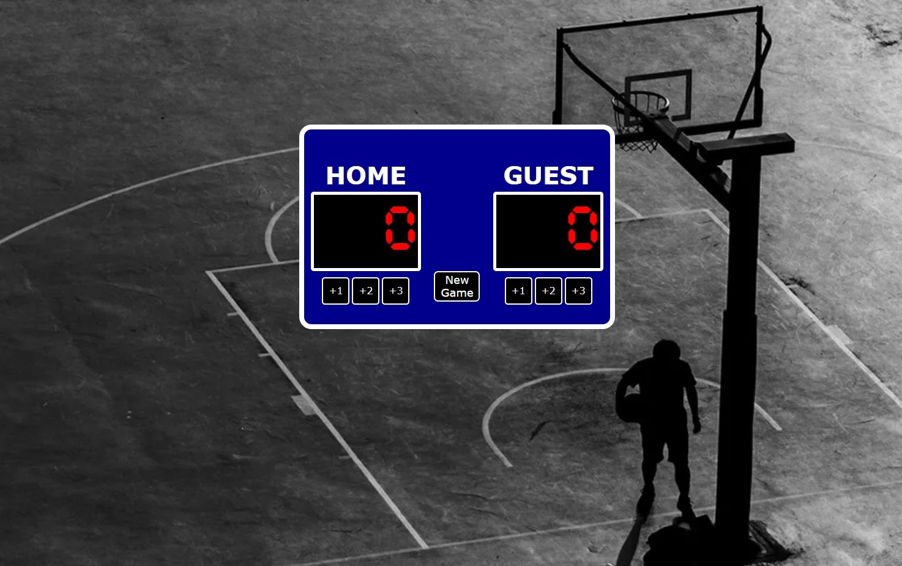

# Basketball Scoreboard
[](https://app.netlify.com/sites/basketball-scoreboard-0360/deploys)

<strong>Netlify Link: <a href="https://basketball-scoreboard-0360.netlify.app/">Click</a></strong>


## About:
- This application is designed to show the current scores of a basketball game.

## Table of contents:
* [About](#about)
* [Demo](#demo)
* [Visuals](#visuals)
* [Tools Used](#tools-used)
* [Installation Setup](#installation) 
* [Contact Information](#contact-information)
* [Credit](#credit)


## Visuals:


## Tools Used:
- HTML
- CSS
- JavaScript
- Npm
- Vite

## Installation:
- Quick start:

```
$ npm install
$ npm start
````
Head over to https://vitejs.dev/ to learn more about using vite

## Demo:
- <a href="https://drive.google.com/file/d/1ygm7QaiFV7DniFv-MB7cKPQOQ72uLLYS/view?usp=sharing"> Demostration Video</a>

## Contact Information:
* GitHub Username: <a href="https://github.com/TiffyAlva">TiffyAlva</a>
* Email: <a href="malito:TiffanyAlvarez54@gmail.com">TiffanyAlvarez54@gmail.com


## Credit:
At Scrimba our goal is to create the best possible coding school at the cost of a gym membership! 💜
If we succeed with this, it will give anyone who wants to become a software developer a realistic shot at succeeding, regardless of where they live and the size of their wallets 🎉
The Frontend Developer Career Path aims to teach you everything you need to become a Junior Developer, or you could take a deep-dive with one of our advanced courses 🚀

- [Our courses](https://scrimba.com/allcourses)
- [The Frontend Career Path](https://scrimba.com/learn/frontend)
- [Become a Scrimba Pro member](https://scrimba.com/pricing)

Happy Coding!
